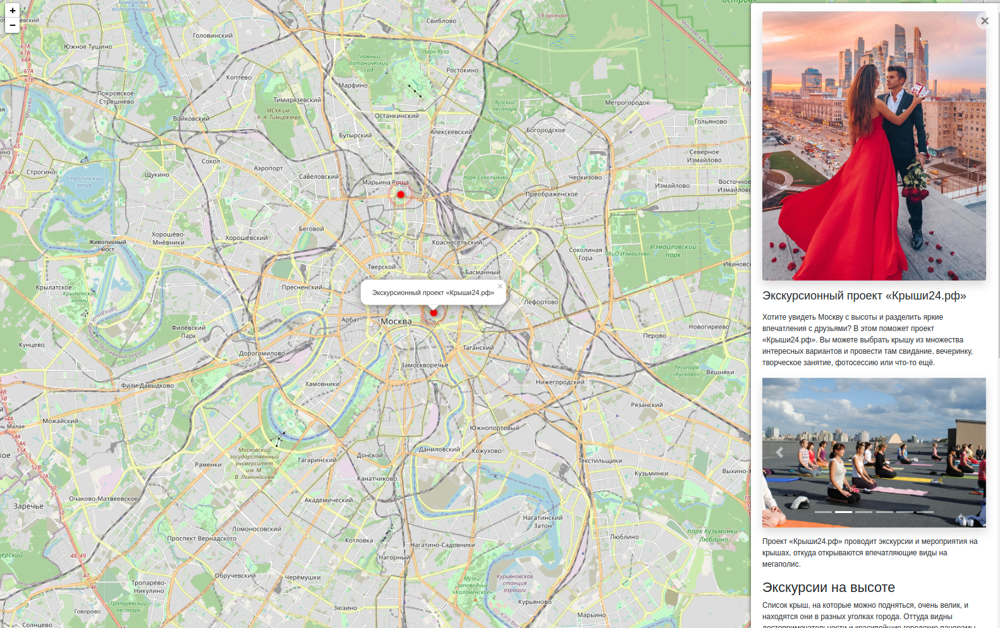
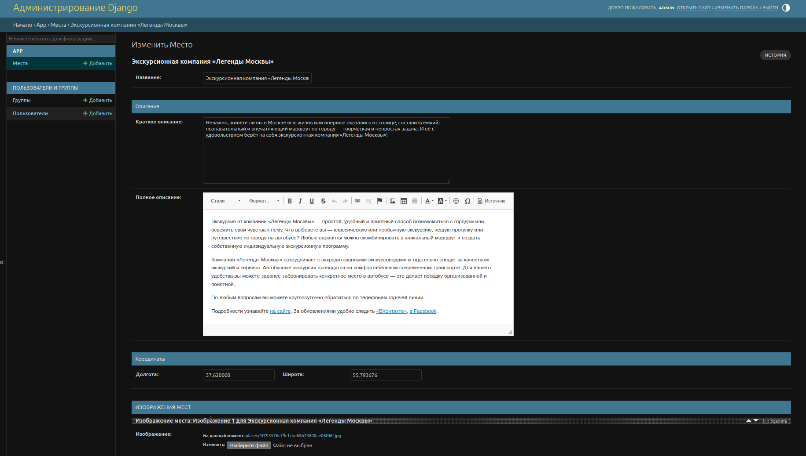
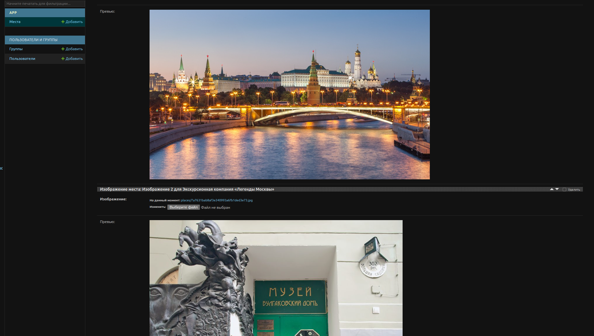

# Were-To-Go
[](https://www.djangoproject.com/)
[](https://www.mysql.com/)
[](https://www.docker.com/)

Сервис для поиска интересных мест.

### Основные возможности
- **Для пользователя**:
  - Просмотр всех интересных мест на карте
  - Просмотр подробностей места с помощью клика по его метке на карте 



  
- **Для администратора**:
  - Создание/Обновление/Удаление мест с помощью панели администратора
  - Добавление/Изменение положения изображений, прикрепленных к месту, с помощью интерфейса
  - Добавление новых мест с помощью консоли





### Запуск на Pythonanywhere
Ссылка на Pythonanywhere: https://bonik0.pythonanywhere.com/
Для запуска на Pythonanywhere используется workflow.yml в .github/workflows


### Локальный запуск проекта

```bash
git clone https://github.com/Bonik0/PelidTeam_Test.git
cd PelidTeam_Test
# Перейдите в папку с конфигами
cd configs
# Отредактируйте файлы в любом текстовом редакторе. Например:
nano db.env
docker compose up -d
```

#### Для создания суперпользователя используйте команду:
```bash
docker-compose exec django python3 src/manage.py createsuperuser
```

#### Для загрузки новых мест через консоль:

- Добавьте json-файл в src/places
- Выполните команду:
```bash
docker-compose exec django python3 src/manage.py load_place /code/src/places/<file_name>.json